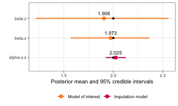
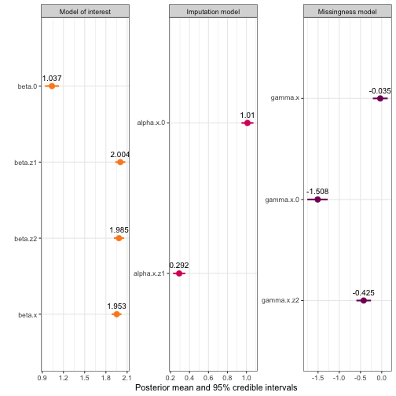

``` r
library(inlamemi)
library(ggplot2)
```

Once we have fitted an `inlamemi` model, we can use the `inlamemi` plot method to see a visual summary of the estimated coefficients and their 95% credible intervals.

As an example, we use a data set with missingness in one variable. For the model, we will then have three levels: the model of interest, the imputation model, and the missingness model. 


``` r
mis_mod <- fit_inlamemi(formula_moi = y ~ x + z1 + z2,
                          formula_imp = x ~ z1,
                          formula_mis = m ~ z2 + x,
                          family_moi = "gaussian",
                          data = mar_data,
                          error_type = "missing",
                          prior.beta.error = c(0, 1/1000),
                          prior.gamma.error = c(0, 1/1000),
                          prior.prec.moi = c(10, 9),
                          prior.prec.imp = c(10, 9),
                          initial.prec.moi = 1,
                          initial.prec.imp = 1)
```

This is the default plot:

``` r
plot(mis_mod)
```


The `plot()` function itself has some arguments that can be used to exclude sub-models, or to create a circle highlighting the coefficients of the variable with error or missingness. There is also an option to make the coefficient names into greek letters:

``` r
plot(mis_mod, greek_coefficients = TRUE)
```




But there are also some further modifications that can be made to the plot object, which is an object of class `ggplot`:


``` r
mis_plot <- plot(mis_mod)
class(mis_plot)
#> [1] "gg"     "ggplot"
```

This means that we can use standard `ggplot2` functions to build on this plot.

If you are familiar with `ggplot2`, you know that it takes a data frame, and then it lets us map the data in the columns very elegantly in whichever way we specify. That means that the plot created above has also been created based on a data frame, and in order to modify the object further, we need to know the names of the columns, in order to refer to them correctly. We can access the data frame like this:


``` r
mis_plot$data
#>            coefficient_type        mean         sd quant_0.025    0.5quant quant_0.975        mode variable_raw
#> beta.0             moi_coef  1.03922790 0.04995733   0.9408389  1.03930759   1.1373987  1.03935602       beta.0
#> beta.z1            moi_coef  2.00424951 0.03642787   1.9327912  2.00425271   2.0756896  2.00425271      beta.z1
#> beta.z2            moi_coef  1.98525144 0.03634388   1.9139699  1.98525088   2.0565362  1.98525089      beta.z2
#> beta.x           error_coef  1.95316560 0.03462607   1.8848986  1.95319979   2.0212340  1.95334122       beta.x
#> gamma.x          error_coef -0.03561449 0.08921616  -0.2091096 -0.03634247   0.1421624 -0.03940939      gamma.x
#> alpha.x.0          imp_coef  1.01042965 0.03224293   0.9471833  1.01043245   1.0736602  1.01043249    alpha.x.0
#> alpha.x.z1         imp_coef  0.29153212 0.03255287   0.2276834  0.29153288   0.3553765  0.29153289   alpha.x.z1
#> gamma.x.0          mis_coef -1.50688996 0.12250364  -1.7534639 -1.50489198  -1.2717722 -1.50468056    gamma.x.0
#> gamma.x.z2         mis_coef -0.42466835 0.08806027  -0.5973460 -0.42466838  -0.2519905 -0.42466839   gamma.x.z2
#>                   model_type error_indicator  var1 var2 variable_greek   variable
#> beta.0     Model of interest               0  beta    0        beta[0]     beta.0
#> beta.z1    Model of interest               0  beta   z1       beta[z1]    beta.z1
#> beta.z2    Model of interest               0  beta   z2       beta[z2]    beta.z2
#> beta.x     Model of interest               1  beta    x        beta[x]     beta.x
#> gamma.x    Missingness model               1 gamma    x       gamma[x]    gamma.x
#> alpha.x.0   Imputation model               0 alpha    0       alpha[0]  alpha.x.0
#> alpha.x.z1  Imputation model               0 alpha   z1      alpha[z1] alpha.x.z1
#> gamma.x.0  Missingness model               0 gamma    0       gamma[0]  gamma.x.0
#> gamma.x.z2 Missingness model               0 gamma   z2      gamma[z2] gamma.x.z2
```

Now, let's say we would like to have three separate plots, one for each sub-model. We could do this using `facet_wrap()`:


``` r
mis_plot +
  facet_wrap(~model_type, scales = "free")
```


We can make the same plot with the greek names:


``` r
plot(mis_mod, greek_coefficients = TRUE) +
  facet_wrap(~model_type, scales = "free")
```


We could also add a different theme:


``` r
plot(mis_mod, greek_coefficients = TRUE) +
  facet_wrap(~model_type, scales = "free") +
  theme_minimal()
```


Any other changes through the `theme` function could also be done, for instance we could remove the legend since this isn't necessary when we have a faceted plot.


``` r
plot(mis_mod, greek_coefficients = TRUE) +
  facet_wrap(~model_type, scales = "free") +
  theme(legend.position = "none")
```


You could also change the font and font size here, plus many other options. Here are some ways you could modify the font in the facet header and axis title, using the `showtext` package for selecting a different font from Google fonts:

``` r
library(showtext)
showtext_auto()
js <- "Josefin Sans"
font_add_google(js)

plot(mis_mod, greek = TRUE) +
  facet_wrap(~model_type, scales = "free") +
  theme(legend.position = "none",
        strip.text = element_text(family = js, size = 13),
        axis.title = element_text(js))
```

The plots can also be faceted by variable instead of model level:

``` r
plot(mis_mod, greek_coefficients = TRUE) +
  facet_wrap(~variable, scales = "free", labeller = label_parsed) 
```


In this case, that isn't terribly useful, but if you for instance have estimates from another model you would like to compare with inlamemi, you could join those results to `mis_plot$data` and then facet by variable (with method on the y-axis) to see the comparison clearly.

If you would like to add points or lines to the plot, this can also be done in an additional `geom` layer. For instance, since this data is simulated, I can add points at the numbers that were used for the simulation:

``` r
mis_truth <- tibble::tribble(
  ~"variable", ~"value",
  "beta.0",  1,
  "beta.x",  2, 
  "beta.z1", 2, 
  "beta.z2", 2,
  "alpha.x.0",  1,
  "alpha.x.z1", 0.3, 
  "gamma.x.0", -1.5,
  "gamma.x.z2", -0.5,
  "gamma.x", 0
  )

plot(mis_mod) +
    geom_point(data = mis_truth, aes(x = value))
```


Or we could add a vertical line at zero:


``` r
plot(mis_mod) +
    geom_vline(xintercept = 0, linetype = "dotted")
```


