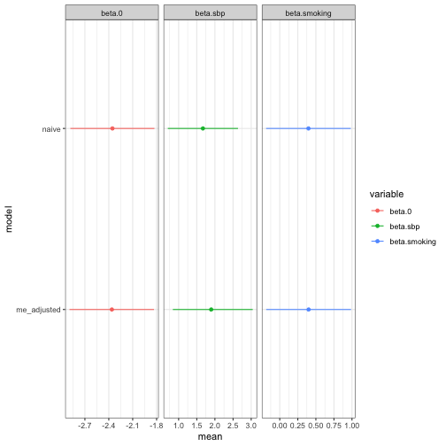

``` r
library(inlamemi)
```


In certain cases, it may be necessary to account for measurement error or missingness in more than one covariate. `inlamemi` is structured in a way that accommodates this, and in this example we illustrate how to specify the input arguments in such a case.

Many of the arguments to `fit_inlamemi` are specific to one of the error variables, such as `formula_imp` (specifying the formula for the imputation model), `error_type` (specifying the type(s) of error for a given variable), `repeated_observations`, `classical_error_scaling` and `prior.beta.error` (specifies the prior for the coefficient of the variable with error). In order for these to be specified correctly in the case where we have multiple error variables, the input is structured in lists, where the first list element corresponds to the argument for the first error variable, the second list element corresponds to the argument for the second error variable, etc. That means that the list elements may themselves be vectors of multiple elements, for instance if the first error variable has Berkson error and missingness and the second error variable has classical error, the `error_type` variable would be `error_type = list(c("berkson", "missing"), "classical")`.

|Error types | Likelihood | Response | Covariate with error | Other covariate(s) |
|:-----------|:----------|:--------|:----------|:------------|
| Classical (present in two covariates)| Gaussian | `y` |`x1`, `x2` | `z` |

In this example, we have a simple case with three covariates (`x1`, `x2` and `z`), where two of these have classical measurement error (`x1` and `x2`). We believe that `x1` is correlated with the error free covariate `z`, but that `x2` is independent of the other covariates. Here is our data:


``` r
head(two_error_data)
#>           y         x1         x2    x1_true   x2_true          z
#> 1 11.479199  3.9241547  2.0065523  2.9122427 1.0015263  0.9819694
#> 2  7.425331  0.1536308  0.6705511  1.4380422 1.2869254  0.4687150
#> 3  2.337587 -0.7050359  0.1312219 -0.1184743 1.5287945 -0.1079713
#> 4  3.006696 -2.1684821 -1.5747725  0.2022806 0.8315696 -0.2128782
#> 5 12.248170  2.7510710  1.8532884  3.1277636 1.1663660  1.1580985
#> 6 13.478741  0.8219551  2.5649969  2.8480912 1.8619438  1.2923548
```


In this case, we will need to specify the entire `control.family` argument manually. This is done like this:


``` r
# Multiple error variables
control.family <- list(
  # Model of interest
  list(hyper = list(prec = list(initial = log(1),
                                param = c(10, 9),
                                fixed = FALSE))),
  # Classical error model for x1
  list(hyper = list(prec = list(initial = log(1),
                                param = c(10, 9),
                                fixed = FALSE))),
  # Imputation model for x1
  list(hyper = list(prec = list(initial = log(1),
                                param = c(10, 9),
                                fixed = FALSE))),
  # Classical error model for x2
  list(hyper = list(prec = list(initial = log(1),
                                param = c(10, 9),
                                fixed = FALSE))),
  # Imputation model for x2
  list(hyper = list(prec = list(initial = log(1),
                                param = c(10, 9),
                                fixed = FALSE)))
)
```

If you are uncertain about the order of the model levels, look at the order in the data stack. `fit_inlamemi` calls the function `make_inlamemi_stacks` to create the data stack, so we can view it like this:


``` r
stack_two_error <- make_inlamemi_stacks(
  formula_moi = y ~ x1 + x2 + z,
  formula_imp = list(x1 ~ z, x2 ~ 1),
  family_moi = "gaussian",
  data = two_error_data,
  error_type = list("classical", "classical"))
```

And then we can see the order of the models by looking at 


``` r
stack_two_error$data$names
#> $y_moi
#> [1] "y_moi"
#> 
#> $x1_classical
#> [1] "x1_classical"
#> 
#> $x1_imp
#> [1] "x1_imp"
#> 
#> $x2_classical
#> [1] "x2_classical"
#> 
#> $x2_imp
#> [1] "x2_imp"
```
Then we go on to fit the model:


``` r
two_error_model <- fit_inlamemi(formula_moi = y ~ x1 + x2 + z,
                             formula_imp = list(x1 ~ z, x2 ~ 1),
                             family_moi = "gaussian",
                             data = two_error_data,
                             error_type = list("classical", "classical"),
                             prior.beta.error = list(c(0, 1/1000), c(0, 1/1000)),
                             control.family = control.family,
                             control.predictor = list(compute = TRUE)
)
```

The summary and plot can be viewed as normal:


``` r
summary(two_error_model)
#> Formula for model of interest: 
#> y ~ x1 + x2 + z
#> 
#> Formula for imputation model: 
#> [[1]]
#> x1 ~ z
#> 
#> [[2]]
#> x2 ~ 1
#> 
#> 
#> Error types: 
#> [[1]]
#> [1] "classical"
#> 
#> [[2]]
#> [1] "classical"
#> 
#> 
#> Fixed effects for model of interest: 
#>            mean        sd 0.025quant 0.5quant 0.975quant     mode
#> beta.0 1.035659 0.2131141  0.6105298 1.038493   1.441933 1.037882
#> beta.z 2.034296 0.6448923  0.9667906 2.071429   3.021473 2.049904
#> 
#> Coefficient for variable with measurement error and/or missingness: 
#>             mean        sd 0.025quant 0.5quant 0.975quant     mode
#> beta.x1 1.936586 0.3497364   1.257687 1.933326   2.634702 1.919545
#> beta.x2 2.068027 0.3077311   1.454184 2.070753   2.665815 2.082262
#> 
#> Fixed effects for imputation model: 
#>                 mean         sd 0.025quant  0.5quant 0.975quant      mode
#> alpha.x1.0 1.0361515 0.04401653  0.9498252 1.0361515   1.122478 1.0361515
#> alpha.x1.z 1.9748165 0.04481266  1.8869287 1.9748165   2.062704 1.9748165
#> alpha.x2.0 0.9734143 0.04551566  0.8841498 0.9734143   1.062679 0.9734143
#> 
#> Model hyperparameters (apart from beta.x1, beta.x2): 
#>                                       mean        sd 0.025quant  0.5quant 0.975quant      mode
#> Precision for model of interest  1.1406833 0.3652831  0.5828657 1.0877373   2.005173 0.9895699
#> Precision for x1 classical model 1.0712067 0.2075480  0.7158741 1.0532570   1.529721 1.0206657
#> Precision for x1 imp model       1.0361495 0.1972955  0.7068510 1.0162479   1.480792 0.9752495
#> Precision for x2 classical model 1.0300168 0.1705122  0.7389834 1.0149099   1.408484 0.9832754
#> Precision for x2 imp model       0.9359571 0.1493368  0.6738231 0.9251558   1.260191 0.9054425
```


``` r
plot(two_error_model)
```




