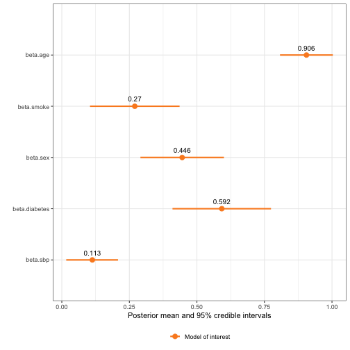

|Error types | Likelihood | Response | Covariate with error | Other covariate(s) |
|:-----------|:----------|:--------|:----------|:------------|
|Classical, missing values | Weibull survival | survival time | `sbp1`, `sbp2` | `smoke`, `age`, `diabetes`, `sex` |


``` r
library(inlamemi)
library(INLA)
library(ggplot2)
```

This example shows how to fit a Weibull survival model to describe the influence systolic blood pressure (SBP) has on survival. The model is the same as in [Skarstein et al. (2023)](https://emmaskarstein.github.io/Missing-data-and-measurement-error/missing_and_mismeasured_covariate.html), but just using `inlamemi` rather than plain INLA.

We assume there to be some measurement error in the SBP measurements. For some of the patients we have repeated measurements, but not for all, and for some patients both of the measurements are even missing. Therefore we are dealing with both classical measurement error and missing data in this case.

For the main model of interest, we have the formula
$$
\eta_i = \beta_0 + \beta_{\texttt{sbp}} \texttt{sbp}_i + \beta_{\texttt{sex}} \texttt{sex}_i + \beta_{\texttt{age}} \texttt{age}_i + \beta_{\texttt{smoke}} \texttt{smoke}_i + \beta_{\texttt{diabetes}} \texttt{diabetes}_i.
$$
The error models for the repeated SBP measurement are
$$
\begin{align}
\texttt{sbp}^1_i = \texttt{sbp}_i + u_i^{1}, \\
\texttt{sbp}^2_i = \texttt{sbp}_i + u_i^{2},
\end{align}
$$
and the imputation model for `sbp` is
$$
\texttt{sbp}_i = \alpha_0 + \alpha_{\texttt{sex}} \texttt{sex}_i + \alpha_{\texttt{age}} \texttt{age}_i + \alpha_{\texttt{smoke}} \texttt{smoke}_i + \alpha_{\texttt{diabetes}} \texttt{diabetes}_i.
$$
We begin by specifying the necessary priors:


``` r
# Priors for measurement error variance and true x-value
prior.prec.u <- c(0.5, 0.5) # Gamma(0.5, 0.5) (same as Keogh&Bartlett)
prior.prec.x <- c(0.5, 0.5) # Gamma(0.5, 0.5) (same as K&B)
prec.u <- 2.8
prec.x <- 1

# Prior for shape parameter of the Weibull survival model
prior.exp <- 0.01 # Gamma(1, 0.001) ~ Exp(0.001) (INLA sets prior on theta, r~Exp(0.1*theta))
exp.init <- 1.4
```

And then we fit the model itself. Let me point out some of the things that are special for this model:

- **`inla.surv()`:** Since we have a survival model, the response of the model is `inla.surv(t, d)`. In this case, `t` is the survival time, and `d` is the censoring indicator, indicating whether the patient was still alive at the end of the study period, or whether the patient had actually passed away.
- **`control.family`:** Another thing to note is that since the `fit_inlamemi` function does not have arguments for passing the prior for the shape parameter of the Weibull survival model to `inla`, we instead need to write out the whole `control.family` argument and pass this to `fit_inlamemi`. If you are not used to R-INLA this may look a bit strange, but this is simply how the priors for the three different levels of the model are passed to `inla`. So as you can see it is a list of three lists, and each of these layers corresponds to one model layer, so the first one is for the main model of interest, the second one is for the error model, and the third layer is for the imputation model.
- **`repeated_observations`:** Since we have repeated measurements for SBP, we need to set this argument to `TRUE`.


``` r
survival_model <- fit_inlamemi(
  formula_moi = inla.surv(t, d) ~ sbp + age + smoke + sex + diabetes,
  formula_imp = sbp ~ age + smoke + sex + diabetes,
  family_moi = "weibull.surv",
  data = nhanes_survival,
  error_type = c("classical", "missing"),
  repeated_observations = TRUE,
  control.family = list(
    # Prior for main model of interest (moi)
    list(hyper = list(alpha = list(param = prior.exp,
                                   initial = log(exp.init),
                                   fixed = FALSE))),
    # Prior for error model
    list(hyper = list(prec = list(initial = log(prec.u),
                                  param = prior.prec.u,
                                  fixed = FALSE))),
    # Prior for imputation model
    list(hyper = list(prec = list(initial = log(prec.x),
                                  param = prior.prec.x,
                                  fixed = FALSE)))),
  prior.beta.error = c(0, 1/1000), # Prior for beta.sbp
  control.predictor=list(link=3)) # To specify that for the missing values, we use the third link function ("gaussian", from the imputation model) to predict them.
```


``` r
summary(survival_model)
#> Formula for model of interest: 
#> inla.surv(t, d) ~ sbp + age + smoke + sex + diabetes
#> 
#> Formula for imputation model: 
#> sbp ~ age + smoke + sex + diabetes
#> 
#> Error types: 
#> [1] "classical" "missing"  
#> 
#> Fixed effects for model of interest: 
#>                     mean         sd 0.025quant   0.5quant 0.975quant       mode
#> beta.0        -5.4554579 0.13799666 -5.7189478 -5.4563288 -5.1900272 -5.4574694
#> beta.age       0.9055067 0.04992108  0.8075577  0.9055466  1.0032303  0.9055477
#> beta.smoke     0.2700950 0.08455459  0.1042871  0.2700964  0.4358954  0.2700964
#> beta.sex       0.4455052 0.07882431  0.2909458  0.4455023  0.6000810  0.4455023
#> beta.diabetes  0.5920221 0.09296470  0.4096852  0.5920366  0.7742765  0.5920368
#> 
#> Coefficient for variable with measurement error and/or missingness: 
#>               mean         sd 0.025quant  0.5quant 0.975quant      mode
#> beta.sbp 0.1129965 0.04868109 0.01635449 0.1132714  0.2080286 0.1144219
#> 
#> Fixed effects for imputation model: 
#>                            mean         sd  0.025quant     0.5quant 0.975quant         mode
#> alpha.sbp.0         0.006419430 0.04311744 -0.07813603  0.006419311 0.09097556  0.006419310
#> alpha.sbp.age       0.322564656 0.02956321  0.26459207  0.322563767 0.38054231  0.322563763
#> alpha.sbp.smoke     0.004838549 0.05062298 -0.09443656  0.004838743 0.10411256  0.004838743
#> alpha.sbp.sex      -0.061816327 0.04701640 -0.15401730 -0.061816640 0.03038643 -0.061816640
#> alpha.sbp.diabetes  0.137949653 0.06223949  0.01589798  0.137948401 0.26000846  0.137948396
#> 
#> Model hyperparameters (apart from beta.sbp): 
#>                                       mean         sd 0.025quant 0.5quant 0.975quant     mode
#> Precision for sbp classical model 1.376777 0.04092497  1.2967392 1.376586   1.457851 1.377131
#> Precision for sbp imp model       2.838978 0.26035528  2.3501761 2.830790   3.374149 2.822266
#> alpha parameter for weibullsurv   1.027533 0.04988456  0.9338767 1.025966   1.130248 1.022071
```

``` r
plot(survival_model, plot_intercepts = FALSE, plot_imp = FALSE)
```




