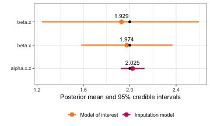
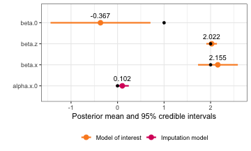
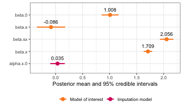

``` r
library(INLA)
library(ggplot2)
library(inlamemi)
library(dplyr)
```

This vignette shows how to fit measurement error and imputation models using the `inlamemi` package for a few different simple simulated data sets. Note that although the data sets describe realistic situations, they are all completely fictitious, and created purely to illustrate how to fit models in different situations.

## Simple example with missingness and two types of measurement error

|Error types | Likelihood | Response | Covariate with error | Other covariate(s) |
|:-----------|:----------|:--------|:----------|:------------|
|Berkson, classical, missing values | Gaussian | $y$ | $x$ | $z$ |

This is a simple simulation with Berkson and classical error as well as missing data, to check that the package works as expected in that scenario.

### Generating the data


``` r
set.seed(2024)
n <- 1000

# Covariate without error:
z <- rnorm(n, mean = 0, sd = 1)

# Berkson error:
u_b <- rnorm(n, sd = 1)
alpha.0 <- 1; alpha.z <- 2
r <- rnorm(n, mean = alpha.0 + alpha.z*z, sd = 1)
x <- r + u_b # Turn off Berkson by commenting out "+ u_b"

# Response:
beta.0 <- 1; beta.x <- 2; beta.z <- 2
y <- beta.0 + beta.x*x + beta.z*z + rnorm(n)

# Classical error:
u_c <- rnorm(n, sd = 1)
x_obs <- r + u_c 

# Missingness:
m_pred <- -1.5 - 0.5*z # This gives a mean probability of missing of ca 0.2.
m_prob <- exp(m_pred)/(1 + exp(m_pred))

m_index <- as.logical(rbinom(n, 1, prob = m_prob)) # MAR
# m_index <- sample(1:n, 0.2*n, replace = FALSE) # MCAR
x_obs[m_index] <- NA

simple_data <- data.frame(y = y, x = x_obs, z = z)
```

### Fitting the model


``` r
# Fit the model
simple_model <- fit_inlamemi(data = simple_data, 
                         formula_moi = y ~ x + z, 
                         formula_imp = x ~ z, 
                         family_moi = "gaussian",
                         error_type = c("berkson", "classical"),
                         prior.prec.moi = c(10, 9),       # Gamma(10, 9)
                         prior.prec.berkson = c(10, 9),   # Gamma(10, 9)
                         prior.prec.classical = c(10, 9), # Gamma(10, 9)
                         prior.prec.imp = c(10, 9),       # Gamma(10, 9)
                         prior.beta.error = c(0, 1/1000), # N(0, 10^3)
                         initial.prec.moi = 1,
                         initial.prec.berkson = 1,
                         initial.prec.classical = 1,
                         initial.prec.imp = 1)
summary(simple_model)
#> Formula for model of interest: 
#> y ~ x + z
#> 
#> Formula for imputation model: 
#> x ~ z
#> 
#> Error types: 
#> [1] "berkson"   "classical"
#> 
#> Fixed effects for model of interest: 
#>            mean        sd 0.025quant 0.5quant 0.975quant     mode
#> beta.0 1.027602 0.2186511  0.6083084 1.025492   1.436240 1.020619
#> beta.z 1.906201 0.3876191  1.2160591 1.893875   2.558432 1.903803
#> 
#> Coefficient for variable with measurement error and/or missingness: 
#>            mean        sd 0.025quant 0.5quant 0.975quant     mode
#> beta.x 1.973221 0.2015696   1.570253 1.975306   2.363884 1.984143
#> 
#> Fixed effects for imputation model: 
#>               mean         sd 0.025quant 0.5quant 0.975quant     mode
#> alpha.x.0 1.033079 0.05058874  0.9338329 1.033087   1.132280 1.033087
#> alpha.x.z 2.024709 0.05225086  1.9222764 2.024692   2.127243 2.024692
#> 
#> Model hyperparameters (apart from beta.x): 
#>                                      mean        sd 0.025quant  0.5quant 0.975quant      mode
#> Precision for model of interest 1.1289547 0.3578772  0.5722733 1.0802543   1.965920 0.9906998
#> Precision for x berkson model   1.1271920 0.3433899  0.5920915 1.0807322   1.930556 0.9946972
#> Precision for x classical model 0.9260566 0.1084821  0.7324524 0.9192407   1.158996 0.9047465
#> Precision for x imp model       0.9779655 0.1252989  0.7530223 0.9705594   1.245496 0.9569073
```


``` r
simple.truth <- tibble::tribble(
  ~"variable", ~"value",
  "beta.x",  beta.x, 
  "beta.z",  beta.z, 
#  "beta.0",  beta.0, 
  "alpha.x.z", alpha.z, 
 # "alpha.0", alpha.0
  )

plot(simple_model, plot_intercepts = FALSE) +
    geom_point(data = simple.truth, aes(x = value))
```

<div class="figure" style="text-align: center">

<p class="caption">plot of chunk unnamed-chunk-4</p>
</div>

## Missing data only 

|Error types | Likelihood | Response | Covariate with error | Other covariate(s) |
|:-----------|:----------|:--------|:----------|:------------|
|Missing values | Gaussian | $y$ | $x$ | $z$ |

In this example, we have missingness in one covariate, but no other measurement error, so this shows how to do simple imputation of a missing covariate in R-INLA.

### Generating the data


``` r
set.seed(2024)
n <- 1000

# Covariate without missingness:
z <- rnorm(n, mean = 0, sd = 1)

# Covariate that will have missingness:
alpha.0 <- 1; alpha.z <- 2
x <- rnorm(n, mean = alpha.0 + alpha.z*z, sd = 1)

# Response:
beta.0 <- 1; beta.x <- 2; beta.z <- 2
y <- beta.0 + beta.x*x + beta.z*z + rnorm(n)

# Missingness:
m_pred <- -1.5 - 0.5*z # This gives a mean probability of missing of ca 0.2.
m_prob <- exp(m_pred)/(1 + exp(m_pred))

m_index <- as.logical(rbinom(n, 1, prob = m_prob)) # MAR
# m_index <- sample(1:n, 0.2*n, replace = FALSE) # MCAR
x_obs <- x
x_obs[m_index] <- NA

missing_data <- data.frame(y = y, x = x_obs, z = z)
```

### Model without imputation

``` r
naive_model <- inla(formula = y ~ x + z, family = "gaussian", data = missing_data)

naive_model$summary.fixed
#>                 mean         sd 0.025quant 0.5quant 0.975quant     mode          kld
#> (Intercept) 2.059952 0.07313492  1.9165113 2.059952   2.203392 2.059952 1.012936e-11
#> x           1.060038 0.04847764  0.9649586 1.060038   1.155118 1.060038 1.018066e-11
#> z           4.242952 0.09766027  4.0514099 4.242952   4.434494 4.242952 1.033686e-11
```

``` r
naive_model$summary.hyperpar
#>                                              mean         sd 0.025quant 0.5quant 0.975quant      mode
#> Precision for the Gaussian observations 0.3082829 0.01379352  0.2818484 0.308078  0.3359021 0.3076677
```
### Model with imputation

``` r
missing_model <- fit_inlamemi(formula_moi = y ~ x + z,
                            formula_imp = x ~ z,
                            family_moi = "gaussian",
                            data = missing_data, 
                            error_type = "missing", 
                            prior.prec.moi = c(2, 1),
                            prior.prec.imp = c(2, 1),
                            prior.beta.error = c(0, 1/1000),
                            initial.prec.moi = 1,
                            initial.prec.imp = 1)

summary(missing_model)
#> Formula for model of interest: 
#> y ~ x + z
#> 
#> Formula for imputation model: 
#> x ~ z
#> 
#> Error types: 
#> [1] "missing"
#> 
#> Fixed effects for model of interest: 
#>             mean         sd 0.025quant  0.5quant 0.975quant      mode
#> beta.0 0.9735076 0.04830102  0.8800577 0.9733148   1.067603 0.9731718
#> beta.z 1.9432463 0.07576310  1.7996969 1.9421270   2.088043 1.9412456
#> 
#> Coefficient for variable with measurement error and/or missingness: 
#>            mean         sd 0.025quant 0.5quant 0.975quant     mode
#> beta.x 2.024994 0.03435627   1.956587 2.025256   2.091859 2.026359
#> 
#> Fixed effects for imputation model: 
#>               mean         sd 0.025quant 0.5quant 0.975quant     mode
#> alpha.x.0 1.031090 0.03135672  0.9695993 1.031087   1.092600 1.031087
#> alpha.x.z 1.983403 0.03205811  1.9205258 1.983404   2.046277 1.983404
#> 
#> Model hyperparameters (apart from beta.x): 
#>                                     mean         sd 0.025quant 0.5quant 0.975quant      mode
#> Precision for model of interest 1.056684 0.05223063  0.9570575 1.055579   1.162652 1.0537658
#> Precision for x classical model 1.143309 0.34507593  0.6479685 1.084275   1.989363 0.9643537
#> Precision for x imp model       1.065744 0.04963685  0.9696392 1.065177   1.165013 1.0653465
```

``` r
missing_truth <- tibble::tribble(
  ~"variable", ~"value",
  "beta.0", beta.0,
  "beta.x",  beta.x, 
  "beta.z",  beta.z,
  "alpha.x.0", alpha.0,
  "alpha.x.z", alpha.z
)

plot(missing_model) +
    geom_point(data = missing_truth, aes(x = value))
```

<div class="figure" style="text-align: center">

<p class="caption">plot of chunk unnamed-chunk-8</p>
</div>


## Random effect in the main model

|Error types | Likelihood | Response | Covariate with error | Other covariate(s) |
|:-----------|:----------|:--------|:----------|:------------|
|Classical | Gaussian | $y$ | $x$ | $z$, random effect $w$ |

In this example, we simulate data that is grouped in such a way that it should be modelled with a random effect in the model of interest.

### Generating the data


``` r
m <- 10 # number of groups
n <- 100 # number of observations per group
N <- m*n # total number of observations

sd_y <- 3 # sd for the noise
sd_w <- 2 # sd for random effect
sd_x <- 2 # sd for covariate without error
sd_u <- 1 # sd for measurement error

# Covariate without error
z <- rnorm(N, 0, 2)

# Covariate with error
x <- rnorm(N, 0, sd_x) # Independent of z, but can change that here
x_obs <- x + rnorm(N, 0, sd_u)

# Random effect
w_per_group <- rnorm(m, 0, sd_w)
w <- rep(w_per_group, each = n)

# Response
y <- 1 + 2*x + 2*z + w + rnorm(N, 0, sd_y)

reff_data <- data.frame(y = y, id = rep(1:m, each = n), x = x_obs, z = z)
```

### Fitting the model

Firstly, if we ignored the measurement error, we might fit a model like this:


``` r
naive_model <- inla(y ~ x + z + f(id, model = "iid"),
                    data = reff_data,
                    family = "gaussian")
summary(naive_model)
#> Time used:
#>     Pre = 1.63, Running = 0.679, Post = 0.0465, Total = 2.36 
#> Fixed effects:
#>               mean    sd 0.025quant 0.5quant 0.975quant   mode kld
#> (Intercept) -0.316 0.560     -1.429   -0.316      0.796 -0.316   0
#> x            1.682 0.051      1.582    1.682      1.782  1.682   0
#> z            2.022 0.058      1.908    2.022      2.136  2.022   0
#> 
#> Random effects:
#>   Name	  Model
#>     id IID model
#> 
#> Model hyperparameters:
#>                                          mean    sd 0.025quant 0.5quant 0.975quant  mode
#> Precision for the Gaussian observations 0.077 0.003      0.070    0.077      0.084 0.077
#> Precision for id                        0.401 0.184      0.145    0.367      0.852 0.305
#> 
#> Marginal log-Likelihood:  -2756.06 
#>  is computed 
#> Posterior summaries for the linear predictor and the fitted values are computed
#> (Posterior marginals needs also 'control.compute=list(return.marginals.predictor=TRUE)')
```


``` r
# curve(dgamma(x, shape = 1.5, rate = 2), to = 2)

reff_model <- fit_inlamemi(formula_moi = y ~ x + z + 
                         f(id, model = "iid", hyper = list(prec = list(initial = -15, param = c(2, 2)))),
                       formula_imp = x ~ 1,
                       family_moi = "gaussian",
                       error_type = "classical",
                       data = reff_data,
                       initial.prec.moi = 1/4, 
                       initial.prec.classical = 1, 
                       initial.prec.imp = 1/4,
                       prior.prec.moi = c(1, 4),
                       prior.prec.classical = c(10, 10),
                       prior.prec.imp = c(1, 4),
                       prior.beta.error = c(0, 1/1000))

summary(reff_model)
#> Formula for model of interest: 
#> y ~ x + z + f(id, model = "iid", hyper = list(prec = list(initial = -15, 
#>     param = c(2, 2))))
#> 
#> Formula for imputation model: 
#> x ~ 1
#> 
#> Error types: 
#> [1] "classical"
#> 
#> Fixed effects for model of interest: 
#>              mean         sd 0.025quant   0.5quant 0.975quant       mode
#> beta.0 -0.3659492 0.54014774  -1.440257 -0.3661872  0.7098422 -0.3661385
#> beta.z  2.0223038 0.05791576   1.908708  2.0223069  2.1358823  2.0223069
#> 
#> Coefficient for variable with measurement error and/or missingness: 
#>            mean        sd 0.025quant 0.5quant 0.975quant     mode
#> beta.x 2.136576 0.1978989    1.75516 2.133829   2.534286 2.122058
#> 
#> Fixed effects for imputation model: 
#>                mean        sd  0.025quant  0.5quant 0.975quant      mode
#> alpha.x.0 0.1022764 0.0711425 -0.03725084 0.1022764  0.2418037 0.1022764
#> 
#> Model hyperparameters (apart from beta.x): 
#>                                      mean         sd 0.025quant  0.5quant 0.975quant      mode
#> Precision for model of interest 0.1111287 0.02063900 0.07677898 0.1090154  0.1577547 0.1045383
#> Precision for x classical model 0.9863541 0.33507883 0.47537156 0.9376203  1.7781313 0.8478562
#> Precision for x imp model       0.2526082 0.02629019 0.20565550 0.2509687  0.3090606 0.2471533
#> Precision for id                0.4122585 0.16678697 0.16510576 0.3857361  0.8099128 0.3358915
```

``` r

reff.truth <- tibble::tribble(
  ~"variable", ~"value",
  "beta.x",  2, 
  "beta.z",  2, 
  "beta.0",  1, 
  "alpha.x.0", 0
)

plot(reff_model) +
    geom_point(data = reff.truth, aes(x = value))
```

<div class="figure" style="text-align: center">

<p class="caption">plot of chunk unnamed-chunk-11</p>
</div>


## Interaction effect with error variable

|Error types | Likelihood | Response | Covariate with error | Other covariate(s) |
|:-----------|:----------|:--------|:----------|:------------|
|Classical | Gaussian | $y$ | $x$ | categorical variable $s$, interaction effect $x:s$ |


Interaction effects between the error prone variable and an (assumed) error-free variable can also be used. The syntax is as normal, an interaction effect between variables `x` and `s` would be specified in the formula for the model of interest as `x:s`. 


### Generating the data


``` r
set.seed(2024)
n <- 1000

# Covariate without error:
s <- c(rep(0, n/2), rep(1, n/2))

# Classical error:
x <- rnorm(n, mean = 0, sd = 2)
u_c <- rnorm(n, sd = 1)
x_obs <- x + u_c 

# Response:
beta.0 <- 1; beta.x.s <- 2
y <- beta.0 + beta.x*x + beta.x.s*x_obs*s + rnorm(n)

interact_data <- data.frame(y = y, x = x_obs, z = z, s = s)
```

### Fitting the model


``` r
interact_model <- fit_inlamemi(formula_moi = y ~ x:s,
                             formula_imp = x ~ 1,
                             family_moi = "gaussian",
                             data = interact_data,
                             error_type = "classical",
                             prior.beta.error = c(0, 0.01),
                             prior.prec.moi = c(10, 9),
                             prior.prec.classical = c(10, 9),
                             prior.prec.imp = c(10, 8),
                             initial.prec.moi = 1,
                             initial.prec.classical = 1,
                             initial.prec.imp = 2)
```


``` r
summary(interact_model)
#> Formula for model of interest: 
#> y ~ x:s
#> 
#> Formula for imputation model: 
#> x ~ 1
#> 
#> Error types: 
#> [1] "classical"
#> 
#> Fixed effects for model of interest: 
#>               mean         sd 0.025quant    0.5quant 0.975quant        mode
#> beta.0  1.00806625 0.07957354  0.8519766  1.00806929  1.1641390  1.00806941
#> beta.s -0.08599411 0.13378176 -0.3483978 -0.08598926  0.1763819 -0.08598926
#> 
#> Coefficient for variable with measurement error and/or missingness: 
#>             mean         sd 0.025quant 0.5quant 0.975quant     mode
#> beta.sx 2.055651 0.06317748   1.931571 2.055549   2.180323 2.055127
#> beta.x  1.709734 0.04039037   1.630268 1.709716   1.789299 1.709645
#> 
#> Fixed effects for imputation model: 
#>                 mean         sd  0.025quant   0.5quant 0.975quant       mode
#> alpha.x.0 0.03481148 0.06849579 -0.09952965 0.03481148  0.1691526 0.03481148
#> 
#> Model hyperparameters (apart from beta.sx, beta.x): 
#>                                      mean         sd 0.025quant  0.5quant 0.975quant      mode
#> Precision for model of interest 0.4107183 0.03317928  0.3491489 0.4094301  0.4796973 0.4069626
#> Precision for x classical model 4.1014561 0.43981351  3.3020907 4.0787164  5.0316880 4.0349042
#> Precision for x imp model       0.2252702 0.01058364  0.2050005 0.2250743  0.2466613 0.2247959
```

``` r
plot(interact_model)
```

<div class="figure" style="text-align: center">

<p class="caption">plot of chunk unnamed-chunk-14</p>
</div>


## Logistic regression with classical error and missing data

|Error types | Likelihood | Response | Covariate with error | Other covariate(s) |
|:-----------|:----------|:--------|:----------|:------------|
| Classical, missing | Binomial | $y$ | $w$ | $z$ |

Here we show how to fit a logistic regression model.


``` r
set.seed(1)
nn <- 1000

z <- rbinom(nn, 1, 0.5)
x <- rnorm(nn, 1-0.5*z, 1)

# Error
w <- x + rnorm(nn, 0, 1)

# Generating missing data, depending on z
eta <- -1 + z
prob_missing <- exp(eta)/(1 + exp(eta))
missing_index <- rbinom(nn, 1, prob_missing)

# Proportion missing:
sum(missing_index)/nn
#> [1] 0.393
```

``` r

# Replace the values in w by missing in case the index for missingness is =1:
w <- ifelse(missing_index==1, NA, w)

# Generate binomial response
eta <- x + z 
prob <- exp(eta)/(1 + exp(eta))
y <- rbinom(nn, 1, prob)

data_binom <- data.frame(x = x, z = z, y = y, w = w)
```

Modeling error and missing data:


``` r
model_binom <- fit_inlamemi(data = data_binom,
                       formula_moi = y ~ w + z,
                       formula_imp = w ~ z,
                       formula_mis = m ~ z,
                       family_moi = "binomial",
                       error_type = c("classical","missing"),
                       prior.prec.classical = c(10, 9),
                       prior.prec.imp = c(10, 9),
                       prior.beta.error = c(0, 1/1000),
                       initial.prec.classical = 2,
                       initial.prec.imp = 1)

summary(model_binom)
plot(model_binom)
```

## Poisson regression with classical error and missing data

|Error types | Likelihood | Response | Covariate with error | Other covariate(s) |
|:-----------|:----------|:--------|:----------|:------------|
| Classical, missing | Poisson | $y$ | $w$ | $z$ |

Here we show how to fit a Poisson regression model, where the model of interest has a random intercept term.


``` r
set.seed(1)
nn <- 1000

z <- rbinom(nn, 1, 0.5)
x <- rnorm(nn, 1-0.5*z, 1)

# Error
w <- x + rnorm(nn, 0, 1)

# Generating missing data, depending on z
eta <- -1 + z
prob_missing <- exp(eta)/(1 + exp(eta))
missing_index <- rbinom(nn, 1, prob_missing)

# Proportion missing:
sum(missing_index)/nn
#> [1] 0.393
```

``` r

# Replace the values in w by missing in case the index for missingness is =1:
w <- ifelse(missing_index==1, NA, w)

# Random effect to include in the regression model:
re <- rep(rnorm(nn/20), each = 20)

# Linear predictor
eta <-  x + z + re  

# Generate Poisson response
y <- rpois(nn, exp(eta))

data_pois <- data.frame(x = x, z = z, y = y, w = w, id = rep(seq(1:50), each = 20))
```

Simple regression models with correct and error-prone variables to check the effect:


``` r
library(lme4)
summary(glmer(y ~ x + z + (1|id), data = data_pois, family="poisson"))$coef

summary(glmer(y ~ w + z + (1|id), data = data_pois, family="poisson"))$coef
```


Modeling error and missing data:


``` r
model_pois <- fit_inlamemi(data = data_pois,
                       formula_moi = y ~ w + z + f(id,model="iid"),
                       formula_imp = w ~ z,
                       formula_mis = m ~ z,
                       family_moi = "poisson",
                       error_type = c("classical","missing"),
                       prior.prec.classical = c(19, 9),
                       prior.prec.imp = c(10, 9),
                       prior.beta.error = c(0, 1/1000),
                       initial.prec.classical = 2,
                       initial.prec.imp = 1)

summary(model_pois)
plot(model_pois)
```


